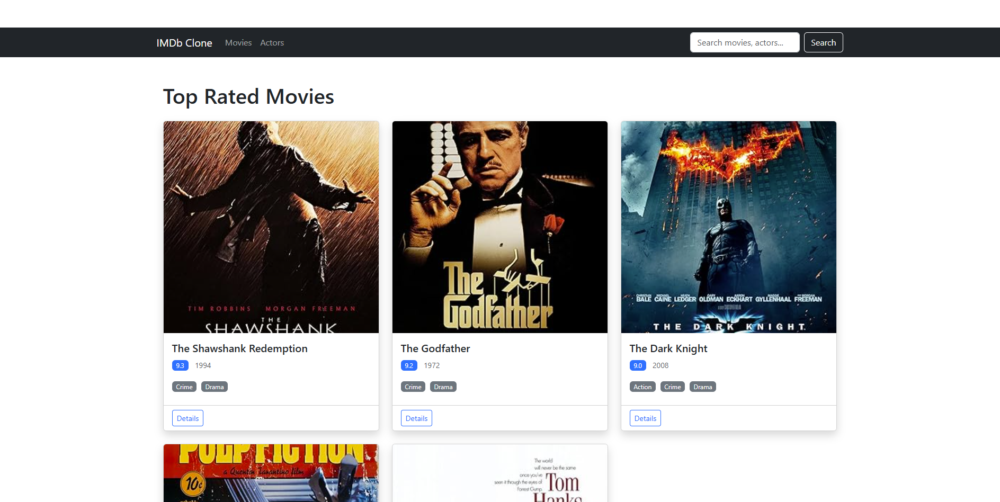

# IMDb Relational Database & REST API



A scalable SQL database and RESTful API for movie information storage and retrieval, inspired by IMDb.

## 📋 Overview

This project implements a comprehensive movie database with a REST API and web interface, allowing users to browse movies, actors, and reviews. The system is built with Flask and MySQL, providing both programmatic access via API endpoints and a user-friendly web interface.

## 🚀 Features

- RESTful API with Swagger documentation
- Web interface for browsing movies and actors
- MySQL relational database with optimized queries
- Pagination, search, and filtering functionality
- User authentication system
- Movie reviews and ratings

## 🛠️ Tech Stack

- **Backend**: Python 3.x, Flask
- **Database**: MySQL
- **API**: Flask-RESTful
- **Frontend**: HTML, CSS, Bootstrap 5
- **Documentation**: Swagger UI

## 📦 Prerequisites

- Python 3.6+
- MySQL 5.7+ or MySQL 8.0+
- pip (Python package manager)

## 🔧 Installation

### Step 1: Clone the Repository

```bash
git clone https://github.com/deepakbalusupati/IMDb-Relational-Database-REST-API.git
cd IMDb-Relational-Database-REST-API
```

### Step 2: Set Up MySQL Database

1. Install MySQL if not already installed:

   - **Windows**: Download and install from [MySQL Official Website](https://dev.mysql.com/downloads/installer/)
   - **Linux**: `sudo apt-get install mysql-server` (Ubuntu/Debian) or `sudo yum install mysql-server` (CentOS/RHEL)

2. Create the database and tables:
   - Log in to MySQL:
     ```bash
     mysql -u root -p
     ```
   - Or on Windows if you have issues:
     ```
     "C:\Program Files\MySQL\MySQL Server 8.0\bin\mysql.exe" -u root -p
     ```
   - Run the schema and sample data scripts:
     ```sql
     source database/schema.sql
     source database/sample_data.sql
     ```

### Step 3: Configure Environment Variables

1. Create a `.env` file in the `config/` directory based on the sample:

   ```bash
   # On Linux/macOS
   cp config/env.sample config/.env
   # On Windows
   copy config\env.sample config\.env
   ```

2. Edit the `.env` file with your MySQL credentials and other configurations.

### Step 4: Install Python Dependencies

```bash
pip install -r requirements.txt
```

### Step 5: Run the Application

```bash
python app.py
```

The application will be available at `http://localhost:5000`

## 🌐 API Usage

### Swagger Documentation

After starting the application, access the API documentation at:

```
http://localhost:5000/api/docs
```

### API Endpoints

| Endpoint                   | Method | Description                      |
| -------------------------- | ------ | -------------------------------- |
| `/api/movies`              | GET    | Get all movies (with pagination) |
| `/api/movies`              | POST   | Add a new movie                  |
| `/api/movies/<id>`         | GET    | Get a specific movie             |
| `/api/movies/<id>`         | PUT    | Update a movie                   |
| `/api/movies/<id>`         | DELETE | Delete a movie                   |
| `/api/movies/top-rated`    | GET    | Get top-rated movies             |
| `/api/movies/<id>/reviews` | GET    | Get reviews for a movie          |
| `/api/movies/<id>/reviews` | POST   | Add a review for a movie         |
| `/api/actors`              | GET    | Get all actors (with pagination) |
| `/api/actors`              | POST   | Add a new actor                  |
| `/api/actors/<id>`         | GET    | Get a specific actor             |
| `/api/actors/<id>`         | PUT    | Update an actor                  |
| `/api/actors/<id>`         | DELETE | Delete an actor                  |
| `/api/users`               | POST   | Register a new user              |
| `/api/login`               | POST   | User login                       |

## 🖥️ Web Interface

The application includes a web interface for browsing movies and actors:

- **Home**: `http://localhost:5000/`
- **Movies**: `http://localhost:5000/movies`
- **Movie Details**: `http://localhost:5000/movies/<id>`
- **Actors**: `http://localhost:5000/actors`
- **Actor Details**: `http://localhost:5000/actors/<id>`
- **Search**: `http://localhost:5000/search?q=<query>`

## 📁 Project Structure

```
IMDb-Relational-Database-REST-API/
│
├── app.py                  # Application entry point
├── requirements.txt        # Python dependencies
├── README.md               # Project documentation
│
├── config/                 # Configuration files
│   ├── config.py           # Application configuration
│   └── env.sample          # Sample environment variables
│
├── controllers/            # API controllers
│   ├── movie_controller.py # Movie API endpoints
│   └── user_controller.py  # User API endpoints
│
├── database/               # Database scripts and connection
│   ├── db_connection.py    # Database connection setup
│   ├── schema.sql          # Database schema
│   └── sample_data.sql     # Sample data for testing
│
├── models/                 # Data models
│   ├── actor_model.py      # Actor data model
│   ├── movie_model.py      # Movie data model
│   └── user_model.py       # User data model
│
├── routes/                 # Route definitions
│   ├── api_routes.py       # API routes
│   └── web_routes.py       # Web interface routes
│
├── static/                 # Static files (CSS, JS, images)
│   ├── css/                # CSS styles
│   ├── js/                 # JavaScript files
│   ├── images/             # Image assets
│   └── swagger.json        # Swagger API documentation
│
├── templates/              # HTML templates
│   ├── base.html           # Base template
│   ├── index.html          # Home page
│   ├── movies.html         # Movies list
│   └── ...                 # Other templates
│
└── utils/                  # Utility functions
```

## 🔍 Troubleshooting

### Database Connection Issues

- **Windows**: Ensure MySQL service is running (check Services app)
- **Linux**: Check MySQL status with `sudo systemctl status mysql`
- Verify your database credentials in the `.env` file
- Make sure the database and tables exist

### Application Won't Start

- Check if required port (5000) is already in use
- Verify all dependencies are installed
- Check for error messages in the console output

## 🔒 Security Notes

- This application uses environment variables for sensitive information
- Never commit the `.env` file with real credentials to version control
- The sample passwords in sample_data.sql are for demonstration only
